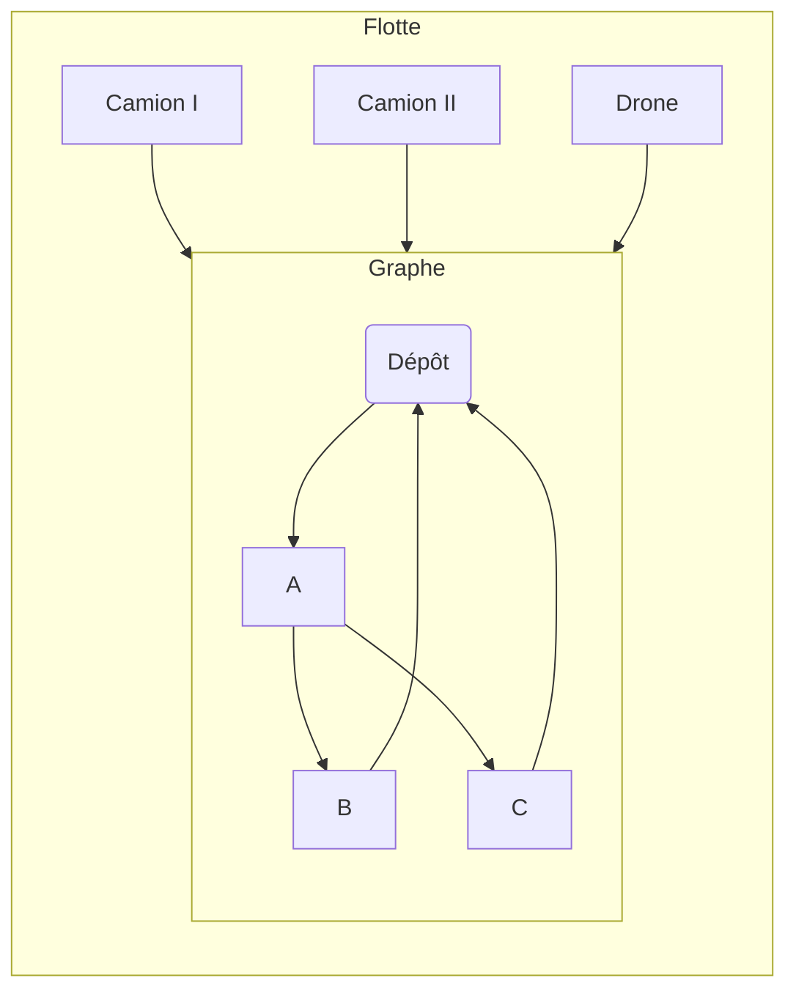

# Projet ERO : Déneigement
---

## 1. Contexte

* Objectif : déneiger tous les tronçons d’un secteur urbain.
* On dispose de 3 types de véhicules : Camion léger (Type I), Camion lourd (Type II), Drone (D).
* On cherche à minimiser le coût total (mobilisation + distance + temps).

---

## 2. Éléments du modèle

### 2.1. Nœuds et tronçons

* **V** : ensemble des points (intersections et dépôt).
* **E** : ensemble des tronçons à déneiger (liens entre deux points).

### 2.2. Flotte disponible

* **F** : types de véhicules = {I, II, D}.
* **K** : véhicules individuels (chaque véhicule a un type dans F).

## 3. Paramètres

* **length(i,j)** : longueur du tronçon (m).
* **speed\[f]** : vitesse moyenne du type f (km/h).
* **cost\_fixed\[f]** : coût fixe d’utilisation d’un véhicule de type f (€).
* **cost\_km\[f]** : coût par km pour le type f (€).
* **cost\_h\[f]** : coût par heure pour le type f (€).
* **Tmax\[f]** : durée maximale d’une tournée pour le type f (h).

---

## 4. Variables de décision

* **x\[k]\[i]\[j]** = 1 si le véhicule k parcourt le tronçon i→j, sinon 0.
* **y\[k]** = 1 si on utilise le véhicule k, sinon 0.

---

## 5. Coût total (fonction objectif)

Minimiser :

```
TotalCost = sum_{k in K} [ cost_fixed[type(k)] * y[k]
                            + sum_{(i,j) in E} ( cost_km[type(k)] * length(i,j)
                                                + cost_h[type(k)] * (length(i,j)/speed[type(k)])
                                              ) * x[k][i][j]
                          ]
```

* Partie fixe : coût de mobilisation.
* Partie variable distance : coût\_km × distance.
* Partie variable temps : coût\_h × temps de parcours.

---

## 6. Contraintes clés

1. **Couverture** : chaque tronçon (i,j) doit être parcouru exactement une fois :
   `sum_{k} x[k][i][j] = 1` pour tout (i,j).
2. **Activation du véhicule** : si k parcourt (i,j), alors y\[k] = 1 :
   `x[k][i][j] ≤ y[k]`.
3. **Départ et retour au dépôt** : pour chaque k :
   `sum_j x[k][depot][j] = y[k]` et `sum_i x[k][i][depot] = y[k]`.
4. **Durée max** : le temps total de k ne dépasse pas Tmax\[type(k)] :
   `sum_{(i,j)} (length(i,j)/speed[type(k)]) * x[k][i][j] ≤ Tmax[type(k)]`.

---

## 7. Hypothèses chiffrées (Outremont 2024)

| Type      | speed (km/h) | cost\_fixed (€) | cost\_km (€/km) | cost\_h (€/h) | Tmax (h) |
| --------- | ------------ | --------------- | --------------- | ------------- | -------- |
| Camion I  | 30           | 150             | 1.2             | 70            | 4        |
| Camion II | 25           | 180             | 1.5             | 85            | 4        |
| Drone     | 12           | 40              | 0.5             | 30            | 2        |

Sources : sujet ERO 2025 et données Montréal 2024.

---

## 8. Simplifications et limites

* Pas de temps de chargement/déchargement.
* Les drones reviennent toujours au dépôt pour recharger.
* Sous-tours non détaillés 

---

## 9. diagramme Mermaid


